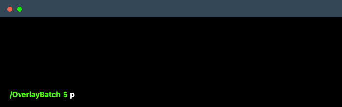

<a id="readme-top"></a>

[![Python][python-shield]][python-url]
[![Pillow][pillow-shield]][pillow-url]
[![MIT License][license-shield]][license-url]

<br />
<div align="center">



  <h3 align="center">OverlayBatch</h3>

  <p align="center">
    A small Python tool for batch-processing images with a transparent overlay.
  </p>
</div>

## About The Project

OverlayBatch watches a folder for new images, resizes them to a fixed output size, applies a transparent PNG overlay, and saves the result as final PNG files.

- Watches a folder and processes images automatically
- Resizes and center-crops each image to a consistent canvas
- Applies the same transparent overlay to every output image
- Supports continuous watching or a single batch run

### Built With

- [![Python][python-shield]][python-url]
- [![Pillow][pillow-shield]][pillow-url]

<p align="right">(<a href="#readme-top">back to top</a>)</p>

## Getting Started

### Prerequisites

- Python 3.9+
- `pip`

### Installation

1. Clone the repository
   ```bash
   git clone https://github.com/webjocke/OverlayBatch.git
   cd OverlayBatch
   ```
2. Install the dependency
   ```bash
   pip install -r requirements.txt
   ```

### Usage

Run the watcher with the default project folders:

```bash
python3 overlaybatch.py
```

Default behavior:

- Reads new images from `input/`
- Writes finished PNG files to `output/`
- Uses `overlay.png` as the overlay
- Produces images at `800x600`

Run a single batch instead of a continuous watcher:

```bash
python3 overlaybatch.py
```

Example with custom folders and dimensions:

```bash
python3 overlaybatch.py \
  --watch-folder incoming \
  --output-folder exported \
  --overlay-image overlay.png \
  --width 1200 \
  --height 1200 \
  --keep-originals
```

<p align="right">(<a href="#readme-top">back to top</a>)</p>

## Notes

- Supported formats include JPG, JPEG, PNG, WEBP, BMP, and TIFF
- Output files keep the original filename stem and are saved as `.png`

<p align="right">(<a href="#readme-top">back to top</a>)</p>

## License

Distributed under the MIT License. See [LICENSE](LICENSE) for more information.

<p align="right">(<a href="#readme-top">back to top</a>)</p>

[python-shield]: https://img.shields.io/badge/Python-3.9%2B-3776AB?style=for-the-badge&logo=python&logoColor=white
[python-url]: https://www.python.org/
[pillow-shield]: https://img.shields.io/badge/Pillow-Image%20Processing-8CAAE6?style=for-the-badge
[pillow-url]: https://python-pillow.org/
[license-shield]: https://img.shields.io/badge/License-MIT-green.svg?style=for-the-badge
[license-url]: ./LICENSE
